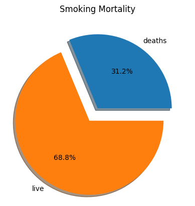
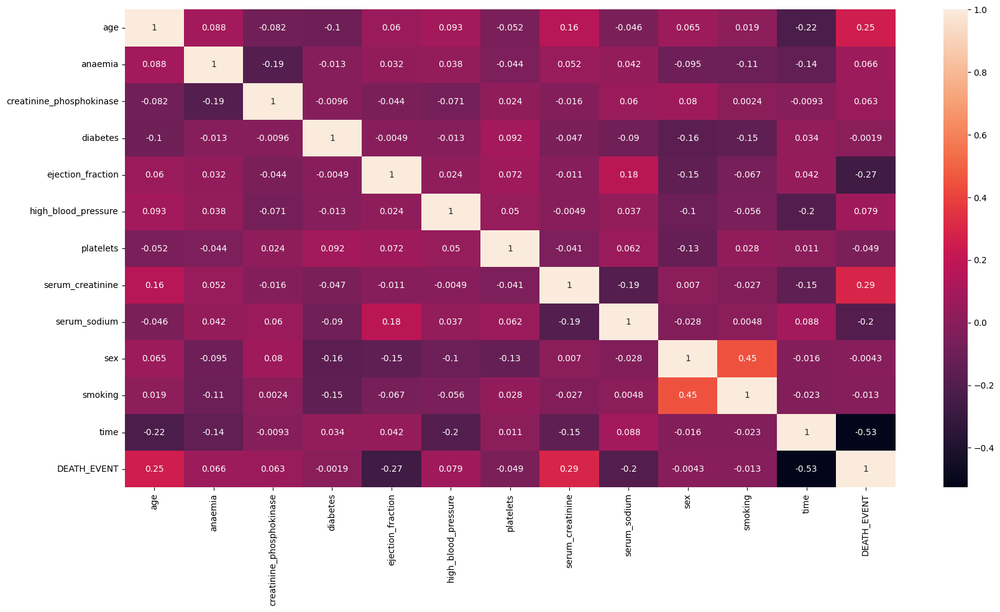
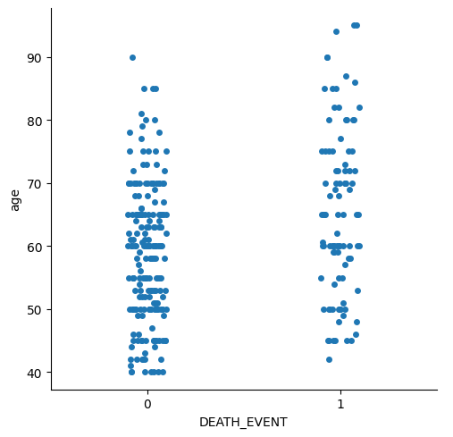

# Heart Failure Prediction

This repository contains a Jupyter notebook for predicting heart failure using various machine learning models. The dataset used for this analysis is based on clinical records of heart failure patients.

## Dataset

The dataset contains 13 features and 300 records which are imbalance so used random oversampler to decrease the imbalance. The features include clinical parameters that are relevant for heart failure prediction.

## Project Structure

- `HeartFailureDataset2_0.ipynb`: The main Jupyter notebook containing data preprocessing, exploratory data analysis, model training, evaluation, and conclusions.

## Installation

To run the notebook, you need to have Python installed along with the necessary libraries. You can install the required libraries using:

```bash
pip install -r requirements.txt
```

## Usage

To run the notebook:

Clone this repository:

```bash
git clone https://github.com/yourusername/heart-failure-prediction.git
```

Navigate to the repository directory:

```bash
cd heart-failure-prediction
```

Install the required libraries:

```bash
pip install -r requirements.txt
```

Open the Jupyter notebook:

```bash
jupyter notebook HeartFailureDataset2_0.ipynb
```


## Data Preprocessing
The data preprocessing steps include handling missing values and scaling numerical features.

## Exploratory Data Analysis
Exploratory data analysis (EDA) is performed to understand the distribution of the data and the relationships between different features. Visualizations are created using matplotlib and seaborn.






## Model Training and Evaluation
Several machine learning models are trained and evaluated:

- Logistic Regression
- Random Forest Classifier
- Gradient Boosting Classifier
- K-Nearest Neighbors (KNN) Classifier


The performance of these models is compared using metrics such as accuracy, precision, recall, and F1-score.

## Best Model
The Random Forest Classifier is identified as the optimal model for this dataset, achieving the highest accuracy and the best recall score. This model is particularly effective in minimizing false negatives, which is crucial for a mortality predictor.

## Conclusion
The notebook concludes that the Random Forest Classifier is the best model for predicting heart failure based on the given dataset.
